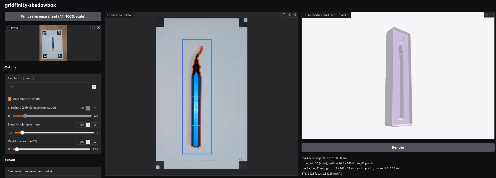

# gridfinity-shadowbox

Turn a top-down photo of an object into a Gridfinity bin with a shadow-board
pocket shaped like that object.

Put the thing on a printed reference sheet, take one photo from above, drop it
into the web UI, and adjust the pocket until it looks right — then export the
STL.



## Install

Needs [uv](https://docs.astral.sh/uv/) and Python 3.12+.

```sh
uv sync --extra ui
```

### Or with Docker

No local Python needed. The image runs the web UI by default, as an unprivileged
user (uid 1000), with `/data` as its working directory:

```sh
docker run --rm -p 127.0.0.1:7860:7860 -v "$PWD:/data" ghcr.io/jarvick257/gridfinity-shadowbox
```

Then open `http://127.0.0.1:7860`. Images are published for each
[release](https://github.com/jarvick257/gridfinity-shadowbox/releases); pin one with
`:X.Y.Z` instead of the default `latest`. The export folder is `/data`, i.e. the directory you
mounted. The CLI works from the same image:

```sh
docker run --rm -v "$PWD:/data" ghcr.io/jarvick257/gridfinity-shadowbox run photo.jpg --height 15 --bin-units 2 2 -o bin.stl
docker build -t shadowbox .   # build it yourself
```

- If your uid is not 1000, add `--user "$(id -u):$(id -g)"` so the container can
  write to the mounted folder and the exported files belong to you.
- Publish the port on `127.0.0.1` as above. The UI has no login, and anyone who
  can reach it can write files wherever the container user may.

## Use it

```sh
uv run shadowbox ui
```

That opens `http://127.0.0.1:7860` in your browser. Everything happens there:

1. **Print reference sheet** — the button at the top left prints the A4 sheet at
   100 % scale. Its ArUco markers give the photo both its scale and its tilt
   correction, so print it without "fit to page".
2. **Photograph the object** lying on the sheet, roughly straight down, with all
   four markers visible. Drop the photo onto the *Photo* field.
3. **Tune it.** The middle pane shows the detected outline drawn on the
   rectified photo, the right pane a live 3D preview of the finished bin:
   - *Outline* — threshold (automatic by default), simplification tolerance,
     minimum blob area.
   - *Cutout* — clearance for a looser or tighter fit, pocket depth, mirror.
   - *Finger relief* — round scallops merged into the pocket edge so you can get
     a finger under the object; diameter, count, angle, inset.
   - *Bin* — size, height, lip style, magnet/screw holes. The bin size is
     auto-fitted to the object when you load the photo; change it if you like.
4. **Export SVG + STL + params.json** into the folder you pick. The STL is the
   finished bin, ready to slice.

Pass a photo on the command line to have it loaded on start:

```sh
uv run shadowbox ui photo.jpg
```

## Scripting (optional)

The same pipeline is available headlessly, which is useful for batching or for
regenerating an old design. `uv sync` without `--extra ui` is enough for this.

```sh
uv run shadowbox sheet -o sheet.pdf                          # the reference sheet as a PDF
uv run shadowbox outline photo.jpg -o object.svg             # photo -> outline SVG (mm units)
uv run shadowbox extrude object.svg --height 20 -o cut.stl   # SVG -> cutter solid
uv run shadowbox extrude object.svg --height 20 --bin-units 2 2 -o bin.stl   # -> finished bin
uv run shadowbox run photo.jpg --height 20 --bin-units 2 2 -o bin.stl        # both steps at once
```

The `params.json` the UI exports replays a session exactly:

```sh
uv run shadowbox extrude object.svg --params object.params.json -o object.stl
```

Every UI control has a matching flag (`--clearance`, `--relief-*`, `--offset`,
`--rotation`, `--bin-lip`, `--bin-magnet-holes`, …); `shadowbox <command> --help`
lists them all. The intermediate SVG is plain mm-unit geometry, so you can also
hand-edit it — or hand-draw one — and extrude that.

## Notes

- Bins are built natively with [manifold3d](https://github.com/elalish/manifold)
  — no OpenSCAD required. The geometry was checked against Gridfinity Rebuilt
  2.0.0 (volume within 0.2 %, cross-sections within its 0.02 mm wall tolerance).
- Bins are solid with the pocket as the only cavity, which is what you want for
  a shadow board.
- The UI runs locally; nothing is uploaded anywhere.

## Development

```sh
uv run pytest                      # UI tests skip without the ui extra
uv run ruff check . && uv run ruff format .
```

## License

MIT — see [LICENSE](LICENSE).
